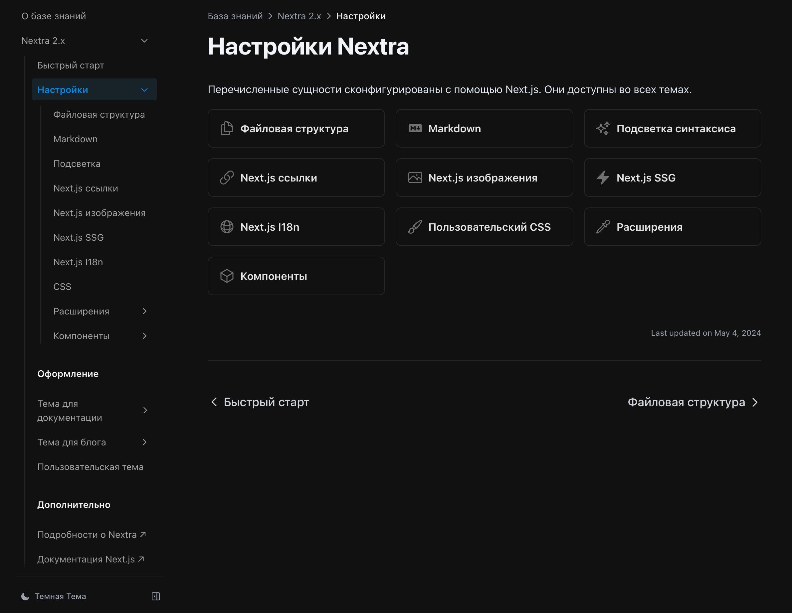

import { Cards, Steps } from 'nextra/components'

# Перевод документации Nextra 2.x

<Steps>

	### Идея

	Для этого сайта я выбрал фреймворк [Nextra ↗](https://nextra.site), поскольку он позволяет быстро развернуть в сети базу знаний с документацией. Nextra – это надстройка над Next.js.

	Однако, [официальная документация по Nextra ↗](https://nextra.site/docs) доступна только на английском языке, что может стать камнем преткновения для русскоязычных пользователей. Я решил устранить этот барьер, а заодно детально разобраться в самой системе.

	### Задача

	Перевести официальную документацию Nextra на русский язык.

	### Реализация

	Одновременно с созданием этого сайта приступил к переводу. Ранее подобным не занимался, поэтому это был для меня интересный опыт. Не скажу, что свободно владею английским языком, но общий смысл технических текстов улавливаю. А с помощью Яндекс Переводчика эта затея оказалась вполне выполнимой. 

	Конечно, переводил я не дословно. Старался передать содержание по смыслу со знанием дела, одновременно проверяя описанные возможности при разработке этого сайта. В итоге получилось так, как получилось. 

	Время от времени возвращаюсь к переводу, когда мне требуется реализовать очередную фичу. Если нахожу неточности, то сразу исправляю.

	Осенью 2024 года Nextra выпустила [третью версию ↗](https://the-guild.dev/blog/nextra-3). Разработчики нашли серьезных спонсоров и теперь усиленно развивают эту систему. Когда замечаю какие-то баги, отправляю им [`pull request'](https://github.com/shuding/nextra/issues). Лично переписываюсь с ведущим разработчиком Nextra [Димой Постоловым ↗](https://github.com/dimaMachina). 

	### Результат

	<Cards num={2}>
		<Cards.Card image arrow title="Смотреть документацию" href="/portfolio/nextra">
			<></>
		</Cards.Card>
	</Cards>

</Steps>

*[В начало страницы](#top-of-page)* 🔝